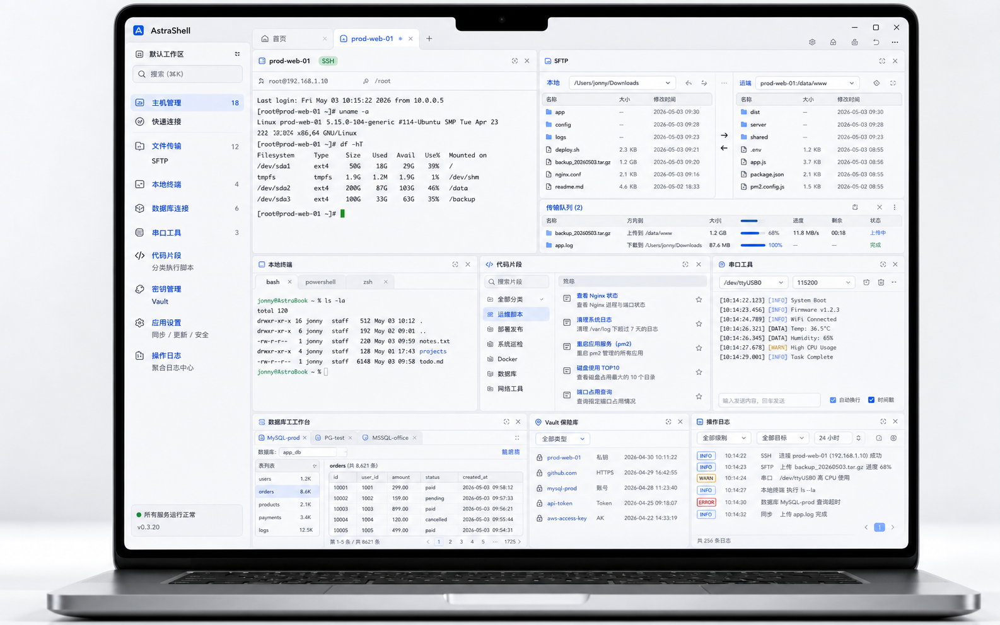

# AstraShell

<p align="center">
  
</p>

<p align="center">
  开源、免费、跨平台的终端工作台，把 SSH、SFTP、本地终端、数据库、串口、代码片段、密钥仓库、同步中心和版本更新收进同一条工作流。
</p>

<p align="center">
  <a href="https://github.com/getiid/AstraShell/releases/latest">下载最新版本</a>
  ·
  <a href="https://github.com/getiid/AstraShell">GitHub 仓库</a>
  ·
  <a href="docs/index.html">项目展示页</a>
</p>



## 项目概览

AstraShell 当前主线是 `app/` 下的 Electron + Vue 3 桌面端，目标不是单独做一个 SSH 客户端，而是把连接、传输、执行、记录、同步和更新整合成一个持续可用的个人运维工作台。

仓库中也包含 `mobile/` 移动端原型，当前成熟度低于桌面端，桌面端仍是主开发与发布对象。

## 当前能力

- SSH 多标签终端，支持快速连接、编码切换、右键复制粘贴和片段执行
- Hosts 主机管理，支持分类、搜索、到期提醒、聚焦卡片和双击直连
- SFTP 双栏工作区，支持本地/远程独立连接、拖拽上传下载和目录级传输
- Database 工作台，支持 MySQL / PostgreSQL / SQL Server 等连接、数据库切换、表浏览和 SQL 查询
- Snippets 代码片段中心，支持分类、说明、提醒日期和执行结果回写
- Local Terminal 多会话，本地标签返回面板不掉线，片段可直接发送到选中标签
- Serial 串口工具，支持端口扫描、连接、ASCII/HEX 和定时发送
- Vault 密钥仓库，统一管理私钥、公钥、证书和 API Token
- Logs 操作日志，按目标聚合记录输入和系统反馈
- Sync 同步中心，固定本地数据库运行，外部数据库文件只作为同步目标
- Update GitHub Release 更新链路

## 推荐工作流

1. 在 Hosts 中整理 SSH 主机，在 Vault 中维护密钥材料。
2. 在 Snippets 中按分类沉淀部署、巡检、发布和恢复脚本。
3. 进入 SSH、本地终端或串口后，通过终端工具直接调用片段。
4. 需要传文件时切到 SFTP 工作区，左右两栏可独立选择本地或远程位置。
5. 需要连库排查时进入 Database，先选服务器，再选数据库，再查看表和执行 SQL。
6. 需要跨设备共享时，通过 Sync 把外部数据库文件作为同步目标。
7. 需要追溯操作时，进入 Logs 查看按目标聚合后的记录。

## 数据与同步策略

AstraShell 采用固定本地数据库方案：

- 运行时始终读写应用目录中的本地数据库
- 外部数据库文件只负责同步，不直接替代当前运行数据库
- 推荐同步位置是 iCloud、SMB、U 盘、NAS 挂载目录等本地可挂载路径
- 不建议多台设备同时高频写同一个同步文件

## 平台与版本

| 平台 | 形态 | 状态 |
| --- | --- | --- |
| macOS | Electron Desktop | 主线发布平台 |
| Windows x64 | Electron Desktop | 已支持 |
| Linux | Electron Desktop | 构建链路已保留 |
| Android | Expo / React Native | 预览方向 |
| iOS | Expo / React Native | 原型方向 |

- 当前桌面端版本号来源：`app/package.json`
- 当前桌面端版本：`0.3.20`
- 发布说明目录：[`docs/release-notes/`](docs/release-notes)

## 本地开发

### 桌面端

```bash
cd app
npm install
npm run dev
```

常用检查：

```bash
cd app
npm run typecheck
npm run lint
npm test
npm run build:web
```

### 移动端

```bash
cd mobile
npm install
npm run start
```

## 打包与发布

桌面端完整打包：

```bash
cd app
npm run dist
```

发布前建议至少确认：

1. `app/package.json` 版本号已更新。
2. `README.md`、`docs/index.html` 和 `docs/release-notes/` 已同步到当前版本。
3. `cd app && npm run typecheck && npm run lint && npm test` 已通过。
4. GitHub Release 资产名称与版本号保持一致。

## 项目结构

```text
AstraShell/
├─ app/                 # Electron + Vue 3 桌面端
├─ mobile/              # Expo React Native 移动端原型
├─ docs/                # 展示页、发布说明、截图资源
├─ memory/              # 项目事实资料
├─ ARCHITECTURE.md      # 架构补充说明
└─ AGENTS.md            # 代理接手指南
```

## 常见问题

### macOS 提示“已损坏，无法打开”

```bash
xattr -dr com.apple.quarantine /Applications/AstraShell.app
```

### 为什么代码片段没有自动出现在另一台设备

当前不是账号云同步模式，而是本地数据库 + 外部数据库文件同步：

- 先在“同步中心”选择外部数据库文件
- 再保存同步配置
- 最后按需要执行立即下载、立即上传或自动上传

### 为什么返回面板后 SSH 或本地终端还在

这是刻意保留的工作流。返回只离开终端视图，不会关闭会话，方便在 SSH、本地终端、SFTP 和数据库工作台之间切换。

## 贡献

- Issue: <https://github.com/getiid/AstraShell/issues>
- Pull Request: <https://github.com/getiid/AstraShell/pulls>

项目保持开源、免费、无阉割功能版本，欢迎继续一起打磨。
